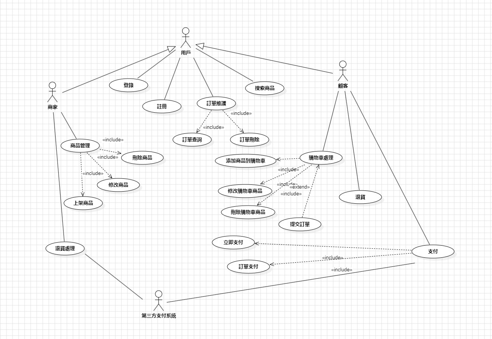

# 11024158 李振瑋 
UML实例（二）：在线购物系统用例图
一、用例图

### 二、用例描述
 用例名：添加购物车商品
 
 简述：顾客有购买商品的意图，但是觉得需要考虑时，可执行添加购物车商品操作。
 
 参与者：消费者
 
 包含：无
 
 扩展：无
 
 继承：无
 
 
 前置条件：顾客必须登录成功。

 细节：在主页面，用户点击商品，进入商品介绍页面；在商品介绍页面，用户点击加入购物车，进入商品信息选择页面；物品信息选择页面，用户选择商品信息，点击确认，系统自动将物品加入购物车。
 
 后置条件：物品信息选择页面，商品信息必须填写完全；购物车的商品数量不能超出特定值。
 
 例外：物品信息选择页面，当商品信息不完全，用户点击确认时系统提示商品信息未填写完全，当购物车的商品数量已达特定值，用户点击确认时系统提示购物车已满。

 限制：无

 注释：无

### 用例名：上架商品

简述：商家想上架新的商品，扩大经营的时候，可使用上架商品操作。

参与者：商家

包含：无

扩展：无

继承：无

前置条件：商家必须登录成功。

细节：在主页面，用户点击商品管理进入商品管理界面，用户点击上架商品，进入上架商品页面；在上架商品页面，用户填写完商品的信息，点击确定，即可上架商品。

后置条件：无

例外：当商品信息填写不完全，商家点击确定时系统提示商品信息未填写完全。

限制：无

注释：无

转载于:https://my.oschina.net/u/1458864/blog/3036157
